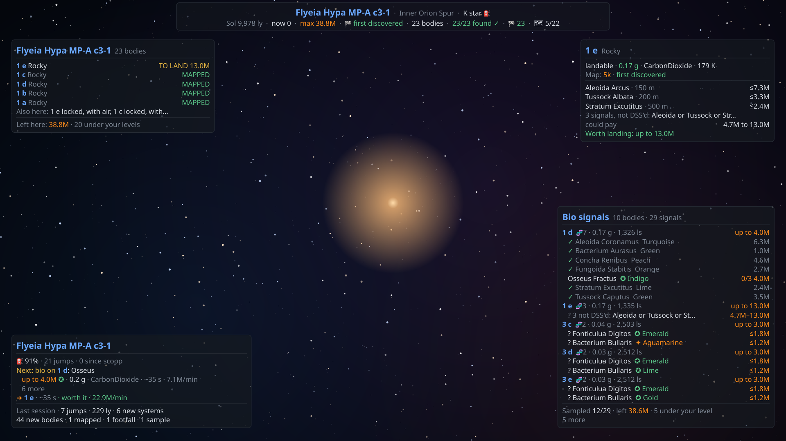
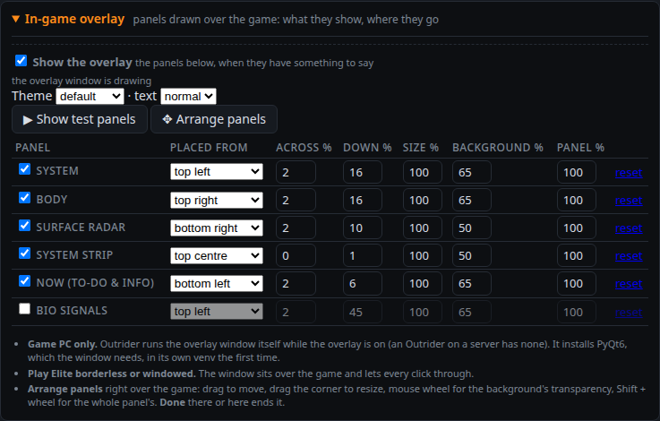
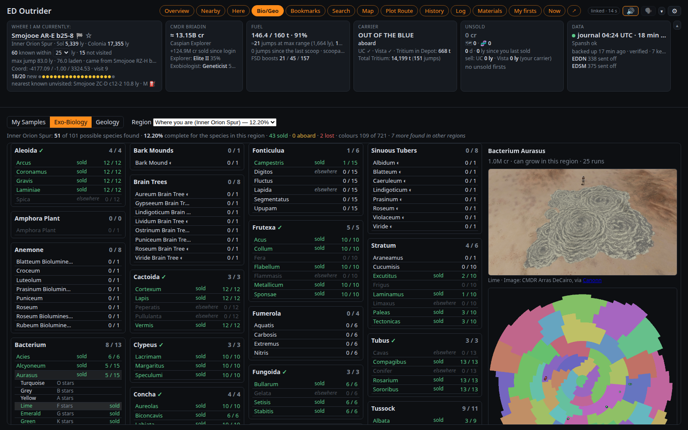

[ED Outrider](../../README.md) · **What's new** · [Install and run](install.md) · [The views](views.md) · [Plot Route](plot-route.md) · [Cargo and trading](cargo-and-trading.md) · [Voice and alerts](voice-and-alerts.md) · [Automation](automation.md) · [On a tablet](tablet.md) · [In-game overlay](overlay.md) · [Uploads](uploads.md) · [Settings and good to know](settings.md) · [For the curious](for-developers.md)

# What's new

What each release brings you, newest first: new things to try, settings worth a look, and anything that changes how
Outrider behaves. When a new release is out, a small **⬆ Update** pill appears in Outrider's header with how to get it.

> [!TIP]
> Updating from an older version? Read every section between yours and the newest: each one only lists what
> changed since the release before it.

---

## 2026.10.21 · 11 October 2026

**Panels over the game, your biology samples on EDDN, and a ✓ for every genus you finish.**

### 🖥 The in-game overlay

Outrider can now draw panels right over Elite's window, on the PC the game runs on: the bodies worth your time in the
system, the body you are heading to, a radar on a body's surface, and, when you tick them, a strip across the top
(where you are, the star, bodies found, mapped, values), **Now (To-Do & Info)** (fuel, data at risk, what to do next,
this session; hidden while docked) and **Bio signals** (every bio signal in the system, the ones worth it highlighted).
Clicks go straight through to the game.

  

- Switch it on in ⚙ Settings → **In-game overlay**, where each panel has its own row: tick it, place it from a corner
  or the middle of the top or bottom edge, size it, set its background's and its own transparency. **Arrange panels**
  lets you do the same right over the game with the mouse; **Show test panels** shows all of them for a minute.
- It needs **PyQt6** (about 100 MB): Outrider installs it into its own venv the first time, with a note at the top of
  the page while it does (the launcher does it at start when the overlay is on). On Linux it also needs `wmctrl` and
  `x11-utils` (`sudo apt install wmctrl x11-utils`); play **borderless or windowed** (not exclusive fullscreen).
- It is a game-PC feature: an Outrider in Docker or on another computer has no overlay. Windows has the code but has
  not been tried yet. More in the [In-game overlay](overlay.md) page.

  

### 🧬 A ✓ for a finished genus

In Bio/Geo → Exo-Biology, a genus gets a green **✓** once you have found every colour of every species that can grow
in that region.

  

### 📡 Uploads

- With EDDN on, your **biology samples** go to it too (the Log and Sample scans, with where on the planet you took
  each, when Outrider read it live).
- A docking at a station on a planet's surface now names that body, as EDMC does; what Outrider sends matches EDMC,
  EDDiscovery and EDDLite field for field.

### 🛠 Also

- A ship bought with **Arx** (its hull has no credit value, so its rebuy covers only the modules) no longer shows a
  "× rebuy" multiple anywhere, and the rebuy-multiple warning levels do not apply to it.
- Days since you last sold count whole days (6.7 days is "6 d", not 7).
- On Linux, `launch_outrider.sh` tells you at start which clipboard program to install for Plot Route's copy
  (wl-copy for Wayland, xclip for X11), with the command for your system.
- The exobiology colour tables are downloaded on Outrider's first start instead of shipped: a fresh install (or a new
  Docker container) needs to be online once for the colour check, as it does for everything else.
- The log's first line names the version.
- **ED Outrider is now GPL v3 or later** (it was GPL v2 or later): the overlay window adapts EDMC Modern Overlay's
  GPL v3 code.

### Before you update

Nothing to do: no journal re-read, nothing changes for Docker. To use the overlay, update on the PC the game runs on.

---

## 2026.10.20 · 10 October 2026

**Checklists for your codex, an auto-target that waits for the game, and a legend for Here's icons.**

### 🧬 Bio/Geo: what you have found, region by region

The **Samples** tab is now **Bio/Geo**, with three parts: **My Samples** (your runs, as before), and two new
checklists.

- **Exo-Biology** shows every species, one box per genus, for a galactic region (where you are, any other, or all of
  them): sold, aboard, lost or only logged, and how many of its colours you have. Click a species to drop its colours
  down; beside the boxes are its picture (Canonn's, credited to the commander who took it) and a galaxy map of where it
  can grow and where you sampled it. The region picker shows how complete each region is for you.
- **Geology** does the same for the codex's geology and anomalies (fumaroles, geysers, Lagrange clouds, the lettered
  anomalies), with how many sites other commanders have reported in the region.
- Both work on the tablet, the list and the details scrolling on their own.

  

### 🎯 Auto-target waits for the game's "danger"

The game marks you "in danger" for 16 to 26 seconds after every jump, and after entering supercruise, with nothing
around. **Target next** pressed then used to refuse again and again. Now it says *"Not targeting due to danger. I will
keep trying until you are out of danger, for up to 50 seconds"* and targets as soon as it clears. Being interdicted
still stops it.

- Charging your FSD as soon as the route is plotted no longer reports "targeting failed".
- A second press of the co-pilot button cancels a Target next that is still waiting.

### 🛣 Plot Route

- **No neutron boosts** (the exact plotter): a route of regular jumps only.
- **A system Spansh doesn't know yet** (one you just discovered) can be a route's start or end: Outrider plots from
  the nearest system Spansh knows and puts yours back in as the first or last stop. Road to Riches and Exomastery too.

### 🔣 Here

- A **legend** under the list says what each icon means, for the icons in that system only.
- The codex marks now name the colour that would be new: **✪ Cobalt**, **✦ Grey**. A Bacterium's colour comes from a
  rare element in each body's own materials, so bodies in one system can each give a different entry.
- Bodies someone else has already mapped are no longer pointed out for mapping; one line per system says so instead.

### 🛠 Also fixed

- Terraformable bodies in Spansh's data are priced as terraformable (some were priced as plain bodies). Outrider
  fetches each system's Spansh data again as you go: nothing to do.
- On the tablet's rail, hardpoints, landing gear and cargo scoop show N/A in supercruise.
- Two Outriders sharing an upload: when the sending one stops, the other carries on from exactly where it stopped.
- Bark Mounds count on the checklist; the checklist's counts and region picker; the checklist works with the keyboard.

---

## 2026.10.19.1 · 9 October 2026

**Fixes, and body names said clearly.**

### 🗣 Body names, letter by letter

With a Piper voice, a body's name is now said one letter at a time: "A 1" is *"ay one"* (it was *"uh one"*), and
"ABC 3 a" is *"ay, bee, see, three, ay"*, each letter clear. System, station and carrier names are read as before.

### 💱 Trade routes count what you trade

A commodity is ticked off once you have traded **all** of it: Plot Route shows **60 of 100 t** until then (one tonne
used to tick off the lot). If a station has less than planned, just undock: Outrider moves on to the next stop and
says what fell short, instead of the planned profit.

### 📡 Two Outriders, one upload

If the Outrider on your PC and one on a server are both switched on for EDDN or EDSM, one now sends and the other
says it is giving way (before, both stopped and nothing was sent until you switched one off).

### 🛠 Also fixed

- A Guardian FSD booster switched off no longer counts towards your jump range and fuel figures.
- The map shows your latest jumps and scans when you open it again.
- A slow, failed map request no longer replaces a newer map with "map failed".
- A market or route opened just as Outrider started still reaches EDDN when its file arrives late.
- The AI assistant stops looking things up at its round limit, and answers.

---

## 2026.10.19 · 9 October 2026

**Share what you find, and find somewhere to dock.**

> [!IMPORTANT]
> - The first start after updating **reads your journals again** (a minute or two for years of them). Nothing is lost.
> - **Docker:** Outrider now always listens on port 8025 inside the container. To use another port, set `PORT` in
>   your `.env` file, not in Settings.

### 📡 Share with EDDN and EDSM (optional, off until you switch it on)

You no longer need EDMC just to upload. In **⚙ Settings → Uploads**:

- **EDDN** sends what you discover (systems, scans, signals, codex entries, markets) to the network that Spansh,
  EDSM and Inara read, as it happens. Personal details are removed first.
- **EDSM** sends your flight log, scans and materials to your own EDSM account, in batches at each jump or docking.
  Enter your EDSM commander name and API key there (from edsm.net → Settings → API key).

  

The header's **Data** tile then shows what each sent today, and anything waiting:

  

> [!WARNING]
> **Use only one uploader.** If EDMC also uploads, or Outrider runs on both your PC and a server, everything is sent
> twice. Turn EDMC's EDDN and EDSM off first. Outrider notices EDMC on the same PC and another Outrider sharing your
> journal folder, but not EDMC on another computer. The [Uploads](uploads.md) page has the details.

If Outrider wasn't running while you played, it catches up when it starts (EDSM up to a week back, EDDN the last
hour). Nothing is ever sent from the beta, the Legacy game, or while you crew in someone else's ship.

### 📍 The nearest place to dock

**Plot Route → 📍 Nearest…** lists the closest stations and fleet carriers that have what you need: Universal
Cartographics, Vista Genomics, repair, refuel, a shipyard. It checks your pad size and how recent each report is, and
**Plot here** plots the route. Deep Space Support Array carriers are marked **🛰 DSSA**. You can also ask by voice:
*"nearest vista"*, *"nearest station with fuel"*.

  

### 🧬 For explorers

- **Tagged plants** become waypoints for your next sample.
- **✪** marks a species new to your codex anywhere in the galaxy (✦ is new in this region only).
- **"Bio possible: check the FSS"** when a body could have life nobody has reported.
- Flying low over a body shows a **bio card** with what is likely there; each genus that's ruled out says why.
- The unsold estimate counts the **full-scan bonus**, and leaves out the ×5 first-footfall bonus in populated systems,
  which never pay it.
- Star kinds, **Canonn Bioforge** links for species, and a system's bodies as a spreadsheet (**⬇ CSV** on Here).

### 🛠 Fixed, among many

- Stopping Outrider lets go of Primary Fire straight away (auto honk could hold it for up to 20 seconds).
- Auto-target closes the galaxy map it opened when it's stopped part way.
- An Apex shuttle ride no longer replaces your ship's details or its fuel figures.
- Decimal values (speech speed 1.3, say) can be saved in Server settings again.
- A password written without quotes in the config file no longer leaves the server without one.
- `launch_outrider.sh` now works on macOS.

---

## 2026.10.16 · 7 October 2026

**Cargo, your fleet carrier, and trading.**

> [!NOTE]
> The first start reads your journals again to pick up your cargo and carrier history.

### 📦 Cargo and your carrier (the Materials tab)

- Your ship's hold, with what you paid for each line.
- Your **fleet carrier's cargo**: confirmed by a sell order (✓), followed from your journal (◷) or entered by you
  (✎, **Recount…**), checked against the carrier's own total. To have a commodity counted exactly, put a sell order on
  it at a price nobody will pay. This works without signing in to Frontier, which Outrider never does.
- The **Carrier** tile shows your tritium and how many jumps it's worth.

### 💱 Trading, kept small

- **Sell / Buy** on any cargo line: where to sell all of it (or buy that much), best price or closest, with your
  profit over what you paid. Then **Plot route here**.
- **Trade routes** in Plot Route: station-to-station hops from where you're docked. Outrider tells you what to trade
  at each stop and ticks the goods off as you go.

  

### 🧭 Plot Route

- **Expressway to Exomastery**: systems with valuable life already reported, each species ticked off as you sample
  it, spoken on arrival.
- A line under the header tiles shows your route's next stop, with a **🎯** to target it in the galaxy map (on the
  game PC).

---

## 2026.10.15 · 6 October 2026

**Road to Riches.**

- **Road to Riches** (contributed by [thshurka](https://github.com/thshurka)): a chain of systems whose planets are
  worth scanning and mapping. Outrider follows it as you fly, shows what's left to do in each system, says the best
  body on arrival, and copies the next system for the galaxy map.
- The **Highway tab is now Plot Route**, with three plotters: Exact, Neutron and Road to Riches.
- Road to Riches is never auto-targeted: it's a route for stopping, not hurrying past.

  

---

## 2026.10.14 · 5 October 2026

**Know when there's an update, and a second tablet.**

- An **⬆ Update** pill appears in the header when a newer release is out, with what's new and how to update. **Skip
  this version** hides it until the next one. To turn the check off: `[server] update_check = false`.
- **A second tablet:** turn off **Show the game controls** in a tablet's Settings, and its pages take the whole width.
  One tablet can carry the controls, another just the information.
- Smaller tablets get a compact layout that fits all eight control buttons.
- **Linux:** the Highway's clipboard copy needs `wl-copy` (Wayland) or `xclip` (X11). The launcher tells you if
  neither is installed.

---

## 2026.10.13 · 5 October 2026

**Windows.**

- **`launch_outrider.bat`** sets Outrider up and starts it on Windows. Double-click it.
- Auto honk, auto-target and the tablet's control rail now work on Windows too. They are **experimental** until
  someone has tried them in game, so reports are welcome.
- A Windows path written in double quotes in the config file (`"C:\Users\..."`) can't be read. Outrider now says so
  and how to write it: `C:/Users/...`, or in single quotes.

---

## 2026.10.12 · 5 October 2026

**Themes for the browser page.**

**⚙ Settings → Display → Theme on this browser** brings the tablet's nine themes to the desktop page: LCARS, Elite,
four from Babylon 5, the Sith and the Rebel Alliance, and Dark. Or keep **Default - Outrider**. Each browser chooses
its own.

  

---

## 2026.10.11 · 4 October 2026

**The tablet speaks, and many more voices.**

- **Play alerts here:** the tablet can speak and play the alert sounds itself, with its own choice of alerts.
- The voice is **Cori** by default, and **⚙ Settings → Voice → More voices** downloads others. If the browser holds
  sound back, a **Click Here To Allow Audio** pill tells you.
- Here's schematic draws each scanned body from its scan.
- Two more tablet themes (Babylon 5's Minbari and Centauri) and emblems for several themes.
- **Settings → Server** edits the whole config file from the page. Outrider can run as a **Docker server**, you can
  **ask it questions by voice**, and an AI assistant can be added if you want one.

  

---

Every change, small ones included, is in the [changelog](../CHANGELOG.md).

[ED Outrider](../../README.md) · **What's new** · [Install and run](install.md) · [The views](views.md) · [Plot Route](plot-route.md) · [Cargo and trading](cargo-and-trading.md) · [Voice and alerts](voice-and-alerts.md) · [Automation](automation.md) · [On a tablet](tablet.md) · [In-game overlay](overlay.md) · [Uploads](uploads.md) · [Settings and good to know](settings.md) · [For the curious](for-developers.md)
